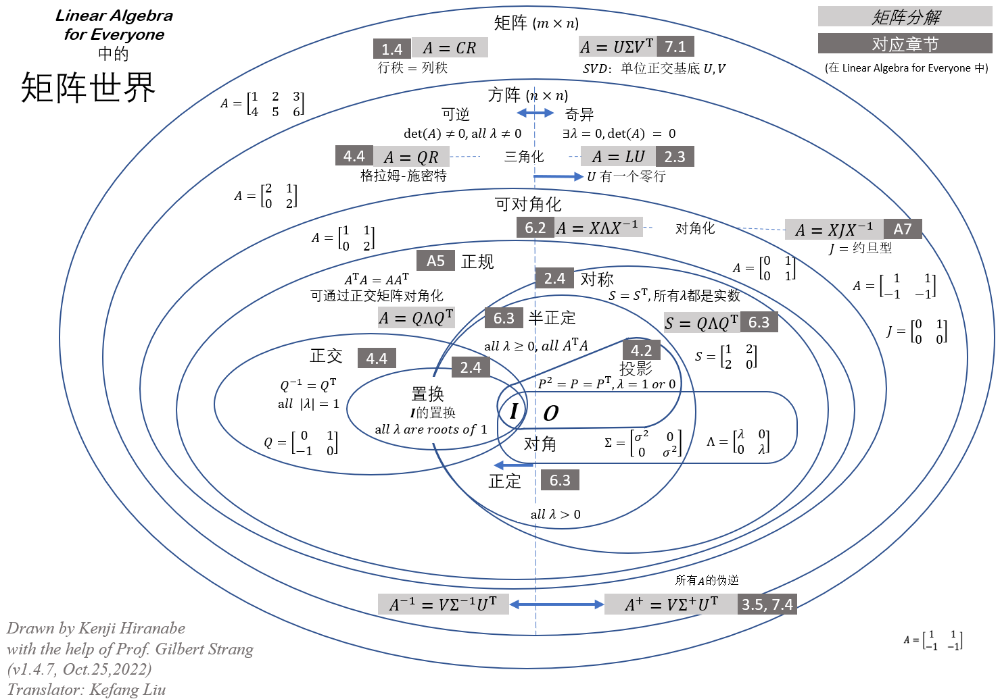

---
tags:
  - Math
  - Linear
author: Bo Yin
---

# 线性代数基础

<figure markdown="span">
  { width="800" }
  <figcaption>矩阵世界</figcaption>
</figure>

!!! note
    
    在此之前我们做一些约定，除非特别说明，否则有
    
    * 向量与矩阵使用粗体大小写，变量使用小写，标量使用大写（非粗体）
    * $(\cdot)^T$，$(\cdot)^H$ 表示矩阵或向量的转置与共轭转置
    * $(\cdot)^{-1}$，$(\cdot)^{+}$ 分别表示矩阵的逆和广义逆
    * $M$ 维单位方阵表示为 $\mathbf{I}_M$
    * 不失一般性，皆考虑复数向量或矩阵

## 向量

1. $M$ 维复数向量表示为

    $$
    \mathbf{x}=\left[\begin{array}{c}
    x_1 \\
    \vdots \\
    x_M
    \end{array}\right]
    $$

    可分解为模长与方向的乘积，即

    $$
    \mathbf{x}=\|\mathbf{x}\| \cdot \frac{\mathbf{x}}{\|\mathbf{x}\|}
    $$

    其中 $\mathbf{x}$ 为

    $$
    \|\mathbf{x}\|=\sqrt{\left|x_1\right|^2+\cdots+\left|x_M\right|^2}=\sqrt{\sum_{m=1}^M\left|x_m\right|^2}
    $$

2. 向量内积表示为

    $$
    \mathbf{x}^H \mathbf{y}=\sum_{m=1}^M x_m^* y_m
    $$

    根据 Cauchy-Schwartz inequality，则有

    $$
    \left|\mathbf{x}^H \mathbf{y}\right| \leq\|\mathbf{x}\| \cdot\|\mathbf{y}\|
    $$

    取等号时，$\mathbf{x}=c \mathbf{y}$ 成立

    $$
    \mathbf{x}^H \mathbf{x}=\sum_{m=1}^M x_m^* x_m=\|\mathbf{x}\|^2
    $$

## 矩阵

1. $M \times K$ 维复数矩阵表示为

    $$
    \mathbf{G}=\left[\begin{array}{ccc}
    g_{1,1} & \ldots & g_{1, K} \\
    \vdots & \ddots & \vdots \\
    g_{M, 1} & \ldots & g_{M, K}
    \end{array}\right]
    $$

2. 矩阵的特征值与特征向量
    
    $\mathbf{A}\in \mathbb{C}^{M \times M}$， 如果存在不为0的向量 $\mathbf{u}$ 使得以下成立

    $$
    \mathbf{A} \mathbf{u}=\lambda \mathbf{u}
    $$

    则 $\mathbf{u}$ 为 $\mathbf{A}$ 特征值 $\lambda$ 对应的特征向量。

    !!! note
        
        矩阵的秩等于其线性独立的列的个数

3. 矩阵的特征值分解

    如果 $\mathbf{A}$ 具有 $M$ 个线性无关的特征向量，则有

    $$
    \mathbf{A}=\mathbf{U D U}^{-1}
    $$

    其中 $\mathbf{U}$ 为归一化特征向量，$\mathbf{D}$ 为对角矩阵，其值为对应的特征值。

    !!! note
        
        $\mathbf{A}$ 可以被对角化为

        $$
        \mathbf{U}^{-1} \mathbf{A U}=\mathbf{D}
        $$

4. Hermitian 矩阵的特征值分解

    如果有 $\mathbf{A}=\mathbf{A}^H$，则

    $$
    \mathbf{A}=\mathbf{U D U}^{H}
    $$

    其中 $\mathbf{U}$ 为单位正交矩阵，即 $\mathbf{U} \mathbf{U}^H=\mathbf{U}^H \mathbf{U}=\mathbf{I}$，$\mathbf{D}$ 为对角矩阵，其值为对应的特征值。
    
    !!! note
        
        $\mathbf{A}$ 可以被对角化为

        $$
        \mathbf{U}^{H} \mathbf{A U}=\mathbf{D}
        $$

    进一步地，矩阵 $\mathbf{A}$ 可以被表示为

    $$
    \mathbf{A}=\sum_{m=1}^M d_m \mathbf{u}_m \mathbf{u}_m^H
    $$
